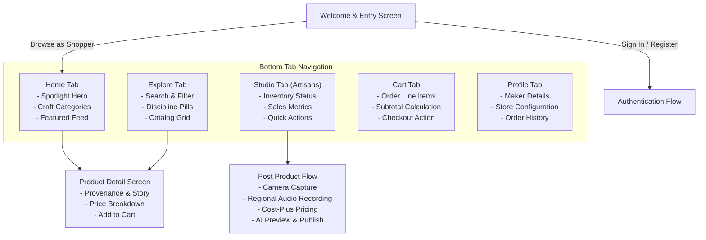

# KlaSetu Mobile Application

## Overview

The KlaSetu Mobile Application is a cross-platform client built using React Native and Expo (SDK 57). Engineered specifically to bridge digital literacy and access gaps for traditional craftspeople, the mobile app provides an intuitive, touch-first toolset that allows artisans in workshops and rural clusters to photograph their creations, narrate craft stories via native microphone input in their regional languages, and manage live digital storefronts directly from their smartphones.

For consumers, the application offers an engaging handheld marketplace to discover authentic Indian handicrafts, learn about maker heritage, and purchase directly from grassroots artisans.

---

## Architectural Layout & User Flows



---

## Core Capabilities

### 1. Mobile AI Listing Creation (`PostProductScreen.js`)
- **Native Camera & Gallery Capture**: Powered by `expo-image-picker` with integrated aspect ratio presets and image compression.
- **Audio Voice Recording**: Leverages `expo-audio` to capture spoken voice notes directly from the smartphone microphone, supporting pause, playback verification, and re-recording.
- **Multilingual Support (24 Regional Languages)**: Modal language picker enabling artisans to select from 24 Indian languages (including Hindi, Marathi, Bengali, Tamil, Telugu, Gujarati, and Punjabi) before initiating AI transcription.
- **Cost-Plus Profit Calculator**: Artisans input basic material and labor expenses; the screen automatically calculates suggested retail prices applying craft-specific margins.
- **Side-by-Side Review Gate**: Before committing a product to the marketplace, artisans review the enhanced studio photography side-by-side with their original picture, inspect generated titles and bullet points in both English and Hindi, and make manual edits if desired.

### 2. Handheld Storefront & Discovery (`HomeScreen.js`, `ProductsScreen.js`)
- **Visual Catalog**: High-density craft grid optimized for smooth 60 FPS scrolling on mobile devices.
- **Craft Discipline Filtering**: Horizontal chip selectors covering pottery, handloom textiles, wood carvings, metalwork, and jewelry.
- **Artisan Provenance Display**: Prominent maker attribution badges on every card, connecting consumers directly with the cultural story behind each piece.

### 3. Artisan Studio Portal (`StudioScreen.js`)
- **Inventory Oversight**: Real-time listing view displaying active inventory, stock levels, and published status.
- **Storefront Metrics**: Overview of total listed products, order counts, and shop performance indicators.
- **Quick Listing Shortcuts**: Direct action buttons to launch the AI camera listing flow.

### 4. Cart & Order Fulfillment (`CartScreen.js`, `ProfileScreen.js`)
- **Local Cart Management**: Persistent cart items managed via React context with instant quantity modification and badge counts.
- **Role Switching**: Smooth transition between Buyer and Artisan interfaces based on user account attributes.
- **Maker Store Setup**: Mobile profile editor allowing artisans to update their studio name, craft discipline, bio, phone number, and workshop location.

---

## Technical Stack

- **Framework**: React Native 0.86.3 with Expo SDK 57
- **UI & Interaction**: React 19.2.3, React Native Safe Area Context, React Native Screens, React Native SVG
- **Device Hardware APIs**:
  - `expo-image-picker`: Hardware camera and photo library access
  - `expo-audio`: Native audio recording and sound playback
  - `expo-constants`: Host metadata and device configuration
  - `expo-status-bar`: Native status bar styling
- **Networking**: Axios HTTP client with request timeout management and authorization interceptors
- **Icons**: `@expo/vector-icons` (Ionicons)

---

## Directory Structure

```
App/
├── src/
│   ├── assets/                # Local static graphics and iconography
│   ├── components/            # Reusable UI elements
│   │   ├── Header.js          # App header with cart badge and navigation triggers
│   │   └── ProductCard.js     # Responsive product card component
│   ├── constants/             # Design tokens and theme constants
│   │   └── theme.js           # Color palette, spacing scales, border radii, shadows
│   ├── context/               # Global state providers
│   │   └── ShopContext.js     # Context for authentication, cart items, and toasts
│   ├── screens/               # Mobile view controllers
│   │   ├── CartScreen.js          # Shopping cart and checkout summary
│   │   ├── HomeScreen.js          # Main marketplace landing view
│   │   ├── LoginScreen.js         # User login form with JWT persistence
│   │   ├── PostProductScreen.js   # Multimodal AI listing creation wizard
│   │   ├── ProductDetailScreen.js # Detailed craft view and artisan provenance
│   │   ├── ProductsScreen.js      # Searchable, filterable catalog grid
│   │   ├── ProfileScreen.js       # User account and artisan store settings
│   │   ├── RegisterScreen.js      # Multi-role user registration
│   │   ├── StudioScreen.js        # Artisan management dashboard
│   │   └── WelcomeScreen.js       # Onboarding entry screen
│   └── services/              # Networking layer
│       └── api.js             # Dynamic backend host resolution and Axios client
├── App.js                     # Root component and navigation state coordinator
├── app.json                   # Expo project metadata and platform permissions
├── babel.config.js            # Babel preset configuration for Expo
├── index.js                   # Application entry registration
├── package.json               # Dependencies and execution scripts
└── README.md                  # Mobile application documentation
```

---

## Setup & Local Development

### 1. Prerequisites
- Node.js 18.x or higher
- npm or yarn package manager
- Expo Go application installed on an Android or iOS physical device (available via Google Play or Apple App Store), or a configured Android Studio emulator / iOS simulator.
- KlaSetu Backend server running on your local network.

### 2. Dependency Installation
Navigate to the `App` directory and install dependencies:

```bash
cd App
npm install
```

### 3. Backend IP Configuration
Physical mobile devices running Expo Go need to connect to your computer's local IP address instead of `localhost`.

The network client (`src/services/api.js`) automatically detects the host IP from Expo manifest data (`hostUri`). If manual configuration is necessary, update the fallback IP in `src/services/api.js`:

```javascript
// Located in src/services/api.js
export const LOCAL_DEV_IP = '192.168.XX.XX'; // Replace with your computer's local Wi-Fi IP
```

Alternatively, call `setCustomBaseUrl('http://<your-ip>:8000')` dynamically within the application.

### 4. Running the Application
Start the Expo Metro bundler:

```bash
npm run start
```

Available terminal commands once Metro starts:
- Press `a` to launch in a running Android emulator.
- Press `i` to launch in an iOS simulator (macOS only).
- Press `w` to run as a progressive web app in your browser.
- Scan the QR code displayed in the terminal using the camera app (iOS) or Expo Go app (Android) to run on a physical device.

---

## Device Permissions

The application requests access to the following native smartphone hardware:
- **Camera (`CAMERA`)**: Used in `PostProductScreen.js` for photographing craft products.
- **Photo Library (`READ_EXTERNAL_STORAGE` / `READ_MEDIA_IMAGES`)**: Used to select existing product photos from the device gallery.
- **Microphone (`RECORD_AUDIO`)**: Used to record native language audio descriptions for the AI transcription pipeline.

---

## Production Build & Distribution

To generate production standalone binaries (.apk / .aab for Android or .ipa for iOS):

```bash
# Install EAS CLI globally if not already present
npm install -g eas-cli

# Log in to your Expo account
eas login

# Configure build profiles
eas build:configure

# Build for Android
eas build --platform android --profile preview

# Build for iOS
eas build --platform ios --profile preview
```
