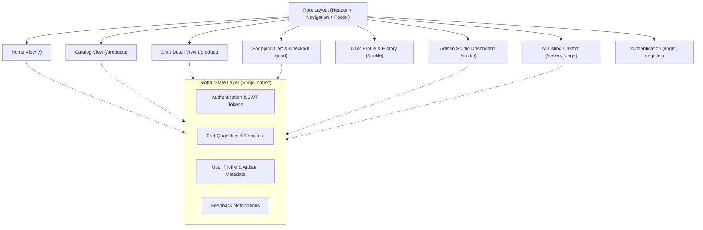

# KlaSetu Web Platform

## Overview

The KlaSetu Web Platform is a responsive, accessible e-commerce marketplace and maker studio designed for desktop, tablet, and mobile web browsers. Built using React 19, Vite, Tailwind CSS v4, and React Router v7, the web application delivers a warm, craft-centered digital storefront for shoppers while providing an intuitive, AI-assisted listing and inventory management studio for registered artisans.

The user interface follows the design principles specified in [DesignDoc.md](file:///d:/Hackathon/SIH2026-Round2/KlaSetu/DesignDoc.md), moving away from generic corporate aesthetics in favor of tactile earthy tones, clean card elevations, maker attributions, and story-driven craft discovery.

---

## Architectural Layout & Routes



---

## Key Features

### 1. Consumer Storefront
- **Warm Hero Experience**: Contextual banners spotlighting living traditions, seasonal craft collections, and maker stories.
- **Horizontal Filter System**: Intuitive pill filters for craft disciplines (pottery, handloom textiles, wood carving, brass & metal, tribal jewelry), price brackets, materials, and customer ratings.
- **Story-Driven Product Cards**: High-resolution imagery, maker shop identity, regional origin, transparent pricing, wishlist toggle, and instant cart actions.
- **Artisan Provenance Details**: In-depth product pages detailing the artisan's personal story, cultural craft traditions, materials used, and care instructions.

### 2. AI-Powered Listing Studio (`/sellers_page`)
- **Direct Image Ingestion**: Artisans upload raw camera images with automatic client-side preview.
- **In-Browser Audio Recording**: Web MediaRecorder API captures spoken voice notes directly from the computer or mobile browser microphone.
- **Regional Language Support**: Language dropdown supporting 24 Indian languages and dialects for speech transcription.
- **Cost-Based Pricing Assistant**: Artisans enter raw material and manual labour costs; the platform automatically projects recommended retail prices based on sustainable craft margins.
- **Review & Approval Gate**: Artisans inspect the AI-enhanced studio image alongside generated English and Hindi titles, bullet descriptions, and tags before publishing.

### 3. Artisan Studio & Business Dashboard (`/studio`)
- **Sales Analytics**: Real-time visualization of aggregate earnings, order counts, and active product stock.
- **Inventory Management**: Listing table with quick actions to publish, unpublish, edit details, or restock craft products.
- **Fulfillment Pipeline**: Track buyer orders through stages (`Pending`, `Confirmed`, `Shipped`, `Delivered`).

### 4. Cart, Checkout & Orders (`/cart`, `/profile`)
- **Real-Time Price Breakdown**: Dynamic subtotal, shipping calculations, and estimated delivery dates.
- **Order Management**: Comprehensive order history tracking past acquisitions and delivery milestones.
- **Artisan Store Customization**: Profile interface allowing craftspeople to update their store name, regional location, craft discipline, and biography.

---

## Design System & Styling Tokens

The application is styled with Tailwind CSS v4 using customized semantic color tokens matching traditional Indian craft materials:

| Token Name | Hex Code | Visual Reference | Application |
|---|---|---|---|
| **Terracotta** | `#B5652F` | Baked earthen clay | Primary branding, active buttons, price callouts |
| **Sage Green** | `#3C6E47` | Natural leaf and vegetable dyes | Secondary accents, verification badges, positive highlights |
| **Warm Linen** | `#F3E6D3` | Unbleached organic cotton / paper | Hero backgrounds, accent panels, pill borders |
| **Warm White** | `#FFFDF9` | Natural stoneware surface | Card backgrounds, page canvas, modal surfaces |
| **Charcoal Brown**| `#2B2420` | Smoked wood / charred earth | Primary typography, high-contrast UI elements |
| **Muted Stone** | `#8A8078` | River stone | Secondary captions, helper text, borders |

---

## Directory Structure

```
Website/
├── public/                    # Static public assets (favicons, logos)
├── src/
│   ├── assets/                # Bundled graphics and imagery
│   ├── components/            # React UI components
│   │   ├── Cart.jsx           # Shopping cart and order review
│   │   ├── Footer.jsx         # Global footer with navigation links
│   │   ├── Header.jsx         # Navigation bar, search input, cart badge
│   │   ├── Hero.jsx           # Landing page hero presentation
│   │   ├── Home.jsx           # Aggregated homepage view
│   │   ├── Login.jsx          # Authentication sign-in form
│   │   ├── PostProduct.jsx    # AI-assisted listing generation studio
│   │   ├── Product.jsx        # Detailed product view and artisan story
│   │   ├── ProductCard.jsx    # Standardized product card component
│   │   ├── Products.jsx       # Searchable and filterable catalog grid
│   │   ├── Profile.jsx        # User account and order management
│   │   ├── Register.jsx       # Multi-role account registration
│   │   └── Studio.jsx         # Artisan dashboard and inventory management
│   ├── context/
│   │   └── ShopContext.jsx    # Centralized React state provider
│   ├── data/
│   │   └── mockData.js        # Fallback datasets and catalog seeds
│   ├── utils/
│   │   └── api.js             # Configured Axios instance for backend calls
│   ├── index.css              # Global styles, font imports, Tailwind rules
│   └── main.jsx               # Application entry point and router definition
├── index.html                 # Main HTML5 entry document
├── package.json               # Node dependencies and project scripts
├── vite.config.js             # Vite bundler configuration
└── README.md                  # Web platform documentation
```

---

## Technology Stack

- **Framework**: React 19
- **Bundler**: Vite 8 with `@vitejs/plugin-react`
- **Styling**: Tailwind CSS v4 with `@tailwindcss/vite`
- **Routing**: React Router v7 (`react-router`)
- **Icons**: Lucide React (`lucide-react`) and Heroicons (`@heroicons/react`)
- **Accessible UI Primitives**: Headless UI (`@headlessui/react`)
- **HTTP Client**: Axios

---

## Installation & Setup

### 1. Prerequisites
- Node.js 18.x or higher
- npm, pnpm, or yarn
- KlaSetu Backend server running (defaults to `http://localhost:8000`)

### 2. Dependency Installation
Navigate to the `Website` directory and install packages:

```bash
cd Website
npm install
```

### 3. Configuration
The application connects to the backend API via Axios. You can customize the base API URL by setting an environment variable or editing `src/utils/api.js`:

```javascript
// Default configuration in src/utils/api.js
const API_BASE_URL = import.meta.env.VITE_API_URL || 'http://localhost:8000';
```

Create a `.env` file in the `Website` directory if custom configuration is required:

```env
VITE_API_URL=http://localhost:8000
```

### 4. Running the Development Server
Start the local development server with Hot Module Replacement (HMR):

```bash
npm run dev
```

The application will be accessible at `http://localhost:5173`.

### 5. Production Build
Generate an optimized production build:

```bash
npm run build
```

Preview the production build locally:

```bash
npm run preview
```

### 6. Linting
Run ESLint to check for syntax and style issues:

```bash
npm run lint
```
